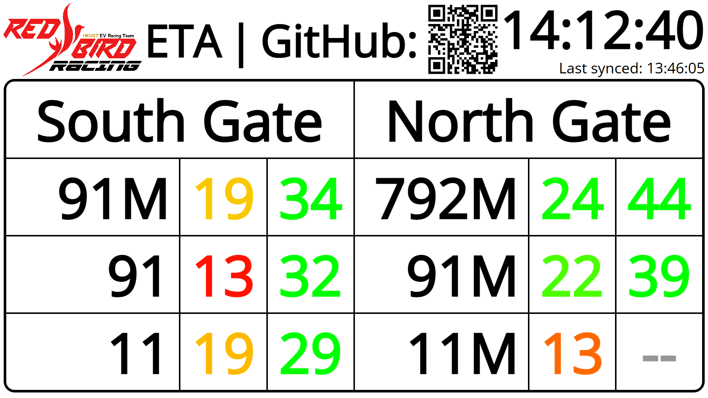

# Bus ETA Report for Hall VIII lab

This was made because it was annoying to take out phone and check how long until bus arrives and then run up when it was too late. With this, I can be constantly reminded when to leave the lab.  
In Hall VIII, the ETA is run by a Raspberry Pi.  
First project by Side project and Yapping sub team of Red Bird Racing EVRT.  
Read the wiki to learn how to install and use the ETA.  

## Screenshot

Meant for 1080p displays. For other resolutions, you are suggested to simply zoom in and out.

## Notes
Room is left for using slots for non-ETA objects like images and animations, as well as replacing route numbers with actual displays.

The clock is synced automatically every hour from [timeapi.io](https://www.timeapi.io/api/timezone/zone?timeZone=Asia%2FHong_Kong).  
The clock is the central time-keeping component used to calculate delta from any given ETA timestamp.  
If the page is paused, the clock is paused as well. Refresh the page to get updated ETAs.  
Use the commented-out line in `update.js` to adjust for ping and ensure correct time.

For performance, v2.2 has migrated to a CORS proxy solution. To use this in a python3 http server, use v2.1 or below.  

The font used is [Open Sans](<https://fonts.googleapis.com/css?family=Open Sans>).

Layout is updated every minute. The cycling is done every 4 seconds (`const displayTime`). ETA is fetched every 10 seconds (doesn't mean data changes every 10 seconds, depends on ETA server).

To optimize for GMB usability, ETA less than 10/13 minutes is omitted. The second/third ETA would be used instead. This helps to make 11/M actually usable, if you trust GMB ETA.

Using Firefox breaks the font rendering and the page looks horrible.
